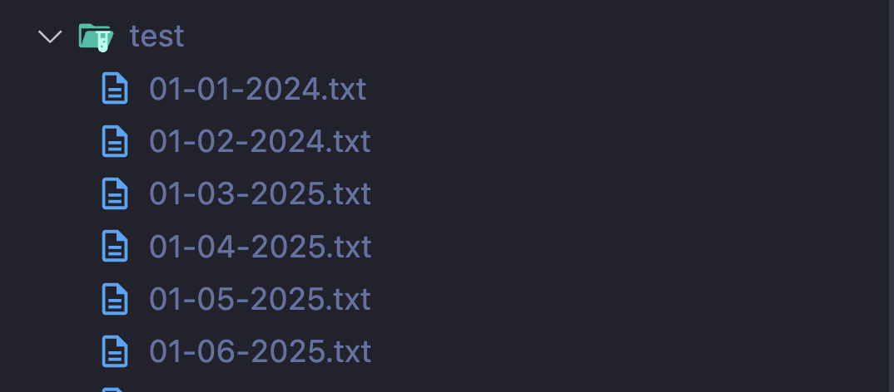

# DotSort

DotSort was born from a personal need: I use [Obsidian](https://obsidian.md) to take notes, but as my number of notes grew, managing them became a mess.

As a Mexican developer, I use the date format `dd-mm-yyyy` to name my files. Over time, this made it harder to keep my notes sorted correctly—especially in systems that don't naturally sort dates in this format. Here's a visual example of the issue:

To solve this, I created **DotSort** — a simple tool to help me (and now, maybe you too) organize date-based files more effectively.

---

## ✨ Features

- 🔄 **Rename files** from `dd-mm-yyyy` format to `yyyy-mm-dd` (ISO-friendly).
- 🗂️ **Automatically create folders** like `01-january-2025` and move files into the correct folder based on the date.
- 🧠 **(Coming soon)**: A smart sorter that organizes files based on their **file type/extension**.

---

## 🗺️ DotSort Roadmap

DotSort is a CLI-first tool designed to help users organize files efficiently by standardizing file names and structuring directories by date or type. The project will evolve over time to include a visual interface and extended customization options.

---

### ✅ Current Phase: CLI MVP

> Goal: Provide a functional, easy-to-use command-line tool to organize files.

- [ ] Interactive CLI using `inquirer`.
- [ ] Commands:
  - Standardize file names with dates.
  - Organize files into folders by date.
  - Group files by extension (**coming soon**).
- [ ] Support for multiple date formats.
- [ ] Multilanguage support (English/Spanish).
- [ ] Exportable as an executable (`npm link`, `pkg`).
- [ ] Logging and summaries of operations.
- [ ] Basic tests for core utilities (`date-utils`, renaming, etc).

---

### 💻 Future: GUI with Electron

> Goal: Make DotSort accessible to non-technical users through a desktop application.

- [ ] Visual interface to browse folders and define rules.
- [ ] Preview of changes before execution.
- [ ] Operation history and undo capability.
- [ ] "One-click organize" mode.
- [ ] Multi-platform packaging (macOS, Windows, Linux).

Stay tuned and feel free to contribute or suggest features via GitHub!

---

## 🚀 Why the name?

“DotSort” is inspired by dotfiles in Linux (hidden files starting with `.`), and the idea of bringing order to file chaos—starting with something as small as a dot.
